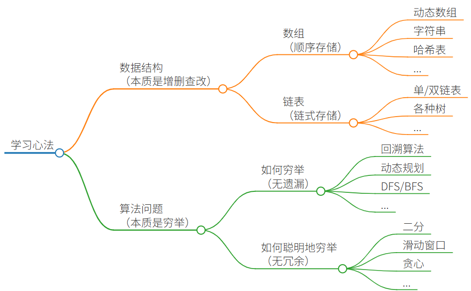

## 数据结构的存储方式

数据结构的存储方式只有两种：[数组（顺序存储）](https://labuladong.online/zh/algo/data-structure-basic/array-basic/) 和 [链表（链式存储）](https://labuladong.online/zh/algo/data-structure-basic/linkedlist-basic/)。

数组和链表才是结构基础

哈希表、栈、队列、堆、树、图等等各种数据结构  都是在链表或者数组上的特殊操作，API 不同而已。

二者的优缺点如下：

[数组](https://labuladong.online/zh/algo/data-structure-basic/array-basic/) 紧凑连续存储，可以随机访问，通过索引快速找到对应元素，而且相对节约存储空间。但正因为连续存储，内存空间必须一次性分配够，所以说数组如果要扩容，需要重新分配一块更大的空间，再把数据全部复制过去，时间复杂度 O(N)；而且你如果想在数组中间进行插入和删除，每次必须搬移后面的所有数据以保持连续，时间复杂度 O(N)。

[链表](https://labuladong.online/zh/algo/data-structure-basic/linkedlist-basic/) 因为元素不连续，而是靠指针指向下一个元素的位置，所以不存在数组的扩容问题；如果知道某一元素的前驱和后驱，操作指针即可删除该元素或者插入新元素，时间复杂度 O(1) *O* (1)。但是正因为存储空间不连续，你无法根据一个索引算出对应元素的地址，所以不能随机访问；而且由于每个元素必须存储指向前后元素位置的指针，会消耗相对更多的储存空间。

比如说 [队列、栈](https://labuladong.online/zh/algo/data-structure-basic/queue-stack-basic/) 这两种数据结构既可以使用链表也可以使用数组实现。用数组实现，就要处理扩容缩容的问题；用链表实现，没有这个问题，但需要更多的内存空间存储节点指针。

[图结构](https://labuladong.online/zh/algo/data-structure-basic/graph-basic/) 的两种存储方式，邻接表就是链表，邻接矩阵就是二维数组。邻接矩阵判断连通性迅速，并可以进行矩阵运算解决一些问题，但是如果图比较稀疏的话很耗费空间。邻接表比较节省空间，但是很多操作的效率上肯定比不过邻接矩阵。

[哈希表](https://labuladong.online/zh/algo/data-structure-basic/hashmap-basic/) 就是通过散列函数把键映射到一个大数组里。而且对于解决散列冲突的方法，[拉链法](https://labuladong.online/zh/algo/data-structure-basic/hashtable-chaining/) 需要链表特性，操作简单，但需要额外的空间存储指针；[线性探查法](https://labuladong.online/zh/algo/data-structure-basic/linear-probing-key-point/) 需要数组特性，以便连续寻址，不需要指针的存储空间，但操作稍微复杂些。

[树结构](https://labuladong.online/zh/algo/data-structure-basic/binary-tree-basic/)，用数组实现就是「堆」，因为「堆」是一个完全二叉树，用数组存储不需要节点指针，操作也比较简单，经典应用有 [二叉堆](https://labuladong.online/zh/algo/data-structure-basic/binary-heap-basic/)；用链表实现就是很常见的那种「树」，因为不一定是完全二叉树，所以不适合用数组存储。为此，在这种链表「树」结构之上，又衍生出各种巧妙的设计，比如 [二叉搜索树](https://labuladong.online/zh/algo/data-structure-basic/tree-map-basic/)、AVL 树、[红黑树](https://labuladong.online/zh/algo/data-structure-basic/rbtree-basic/)、[区间树](https://labuladong.online/zh/algo/data-structure-basic/segment-tree-basic/)、B 树等等，以应对不同的问题。

## 数据结构的基本操作

对于任何数据结构，其基本操作无非遍历 + 访问，再具体一点就是：增删查改。

各种数据结构的遍历 + 访问无非两种形式：线性的和非线性的。

线性就是 for/while 迭代为代表，非线性就是递归为代表。再具体一步，无非以下几种框架：
