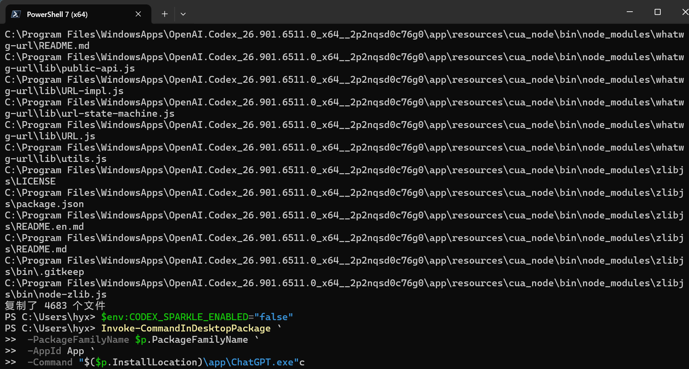
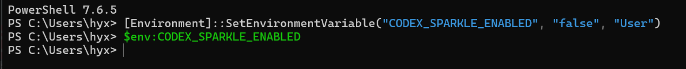

# Codex更新就打不开的解决

昨天打开Codex，发现打不开了，本来找到一份脚本文件，运行后可以打开了，今天电脑更新后，有打不开， 再次运行脚本又可以了， 然后重启了一次又不行了 发现要设定一个默认值。折腾好久，写个笔记存一下。

我习惯把商店软件全塞 D 盘，不想占用 C 盘空间，所以Codex也装 D 盘。

点击codex，没有反应，打开任务管理器一看，ChatGPT 进程明明在后台挂着，但是窗口死活弹不出来。

去小红书查了一下并问了ai 才发现原来是：

MSIX 商店应用挪到 D 盘之后，文件会被系统打上 EFS 加密标记。Codex 启动的时候，会自动解压内置的 `cua_node` 运行库，放到 C 盘用户缓存目录。

但是 Codex 自带的解压工具没办法读取 D 盘带 EFS 加密的源文件，解压到一半中断，生成的 `.staging-*` 文件夹里面文件残缺。

进程能拉起，但是缺少运行库，界面渲染不出来。只要包版本一变，它就会重新执行解压，旧修复直接失效。

## 我使用的解决办法：PowerShell 脚本手动拷贝文件

思路很简单，放弃 Codex 自带解压，用 `xcopy` 带上 `/G` 参数。这个参数可以解密 EFS 加密文件，直接把安装包里完整的 `cua_node` 复制到那个损坏的 staging 目录，补齐文件。

完整脚本：

```powershell
# 1. 获取 Appx 商店版 Codex 包信息
$p = Get-AppxPackage OpenAI.Codex

# 2. 定位出问题的 cua_node 运行时目录
$r = "$env:LOCALAPPDATA\OpenAI\Codex\runtimes\cua_node"

# 3. 找到最新生成的 .staging-* 临时部署文件夹（损坏的目录就在这里）
$s = Get-ChildItem $r -Directory -Force |
    Where-Object Name -like ".staging-*" |
    Sort-Object LastWriteTime -Descending |
    Select-Object -First 1
$id = $s.Name -replace '^\.staging-([^-]+)-.*$', '$1'
$d = "$r\$id"

# 4. 强制杀掉所有残留 ChatGPT/Codex 后台进程
Get-Process ChatGPT -ErrorAction SilentlyContinue | Stop-Process -Force

# 5. 创建目标目录
New-Item -ItemType Directory -Path $d -Force | Out-Null

# 6. 从 App 安装目录，把完整原版 cua_node 文件强行拷贝到损坏的 staging 目录，补齐残缺文件
xcopy "$($p.InstallLocation)\app\resources\cua_node\*" "$d\" /E /I /H /Y /G
# /E 递归复制子目录，/H 复制隐藏/系统文件，/G 处理 EFS 加密文件（Windows 商店包加密）

# 7. 关闭 Sparkle 自动更新（防止再次触发 runtime 部署，再次弄坏文件）
$env:CODEX_SPARKLE_ENABLED = "false"

# 8. 在 Appx 沙箱容器内启动 Codex（普通 Start-Process 无法正常启动商店 MSIX 包）
Invoke-CommandInDesktopPackage `
    -PackageFamilyName $p.PackageFamilyName `
    -AppId App `
    -Command "$($p.InstallLocation)\app\ChatGPT.exe"
```



## 使用要点

1. 先在任务管理器确认所有 ChatGPT 进程全部关掉。
2. 打开 PowerShell 7，粘贴脚本运行。
3. 看到输出复制了几千个文件，代表拷贝成功，脚本会自动拉起 Codex。

## 脚本改动了哪些地方？

源文件夹是 D 盘里面的 Codex 本体目录，脚本只是读取，不会修改 D 盘任何程序文件。

唯一写入修改的路径：

`C:\Users\hyx\AppData\Local\OpenAI\Codex\runtimes\cua_node\.staging-xxxx`

也就是 C 盘的缓存运行库，几百 MB。

这个缓存文件夹可以手动删掉，删完 Codex 又会尝试自动解压，bug 复现。

## 还有的其他方法

### 1. 脚本修复

最快，不用移动大文件。缺点是 Windows 或 Codex 更新之后，bug 可能再次出现，需要重新运行脚本。适合临时救急。

### 2. 应用移动

先把 Codex 挪回 C 盘，打开确认正常，再移回 D 盘。可以重置 EFS 标记，复发概率低。但是移动按钮灰色的时候没法用。

### 3. 直接放在 C 盘

根治这个 EFS 加密 bug，后续更新基本不会炸。代价就是占用 C 盘约 1.78 GB 空间。

## 兜底方案

如果文件拷贝成功，但是依旧只有进程没有窗口，大概率是 Electron GPU 渲染问题，可以尝试下面的命令启动：

```powershell
$p = Get-AppxPackage OpenAI.Codex
Invoke-CommandInDesktopPackage `
    -PackageFamilyName $p.PackageFamilyName `
    -AppId App `
    -Command "$($p.InstallLocation)\app\ChatGPT.exe --disable-gpu --disable-gpu-compositing"
```

## **二编：脚本修复成功打开 Codex，但关机重启，又打不开了。**

我一开始以为脚本一次修好就永久生效，结果关机再开机，旧问题复现：后台有 ChatGPT 进程，窗口不弹出。

原因找到了：Codex 自带的 Sparkle 自动更新检测，每次软件启动 / 系统重启后，会重新校验 runtime。只要版本校验触发，它就会再次尝试自己解压 cua_node 运行库。D 盘 MSIX 包带 EFS 加密，自带解压程序又解压失败，`.staging`目录再次生成残缺文件，之前脚本补好的文件直接作废。

脚本里这一行：

```
$env:CODEX_SPARKLE_ENABLED = "false"
```

作用是 **在当前 PowerShell 会话里临时关闭 Sparkle 更新** ，仅仅对这一次启动生效！

⚠️重点：**它不是写入系统环境变量！重启电脑之后这个环境变量就消失，设置失效。**

所以只在脚本里写这一行治标不治本。PowerShell 窗口一关、电脑一重启，Sparkle 又回来了，下次打开 Codex 依旧会重新解压 runtime 然后炸掉。

## 两种解决思路（永久禁用 Sparkle 更新，防止重启复发）

### 方案 A：用户级永久环境变量（我实际用的，一次性设置，重启依旧生效）

PowerShell粘贴执行：

```
[Environment]::SetEnvironmentVariable("CODEX_SPARKLE_ENABLED", "false", "User")
```

验证方法：完全关闭当前终端， **新开一个 PowerShell 窗口** ，再输入

```
$env:CODEX_SPARKLE_ENABLED
```

输出`false`，代表用户环境变量写入成功。



设置完成后，每次 Codex 启动都会读取这个用户环境变量，不再触发 Sparkle 的 runtime 重新部署校验，也就不会反复重新解压 cua_node，避免再次破坏 staging 运行库目录。

副作用：Codex 不会自动更新。后续想要新版本，需要手动去微软商店点更新。 **更新这个动作本身依然会触发 runtime 解压逻辑，大概率再次炸** ，更新完成后需要重新跑一次修复脚本补齐文件。

✅操作顺序：

1. 设置好环境变量，新开终端验证返回 false
2. 执行一次修复脚本，补齐 staging 目录里残缺的 cua_node 文件
3. 脚本跑完自动拉起 Codex，确认正常打开
4. 重启电脑测试，此时系统会自动加载这个环境变量，Codex 不再重建损坏的 staging 文件夹

### 方案 B：终极根治（之前提到）

把 Codex 直接移到 C 盘安装。C 盘 MSIX 包不会打上 EFS 加密标记，Codex 自带解压程序可以正常提取 cua_node，不管重启多少次、软件更新，基本不会再出现这个 bug。
